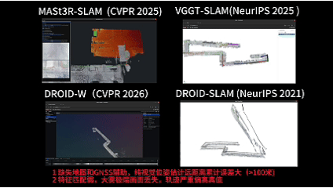
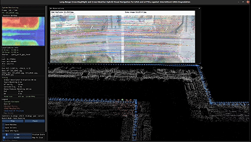
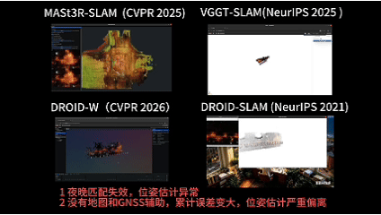
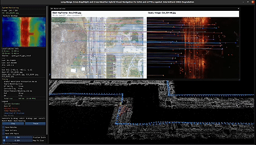

# Atlas-Loc

<p align="center">
  <h1 align="center">Atlas-Loc</h1>
  <p align="center">
    <strong>Li Dongdong</strong> |
    <strong>Yang Tao</strong> |
    <strong>Zhang Yisu</strong> |
    <strong>Qin Shuo</strong> |
    <strong>Li Jing</strong>
  </p>
  <h3 align="center">
    <a href="https://robot-vision.net/">Paper</a> |
    <a href="https://robot-vision.net/">Bilibili Demo</a> |
    <a href="https://robot-vision.net/">YouTube Demo</a>
  </h3>
</p>

<p align="center">
  <strong>Qualitative Comparisons</strong>
</p>

<table align="center">
  <tr>
    <td align="center"><strong>Fog - Baseline</strong></td>
    <td align="center"><strong>Fog - Ours</strong></td>
  </tr>
  <tr>
    <td></td>
    <td></td>
  </tr>
  <tr>
    <td align="center"><strong>Night - Baseline</strong></td>
    <td align="center"><strong>Night - Ours</strong></td>
  </tr>
  <tr>
    <td></td>
    <td></td>
  </tr>
</table>

<br>

## Overview

Atlas-Loc is a dataset-focused repository for our paper and benchmark resources.
At this stage, the repository primarily introduces the **FHY_dataset** and collects
the public-facing links related to the project.

## FHY_dataset

**FHY_dataset** contains multiple sequences of the same scene captured from a
**135 m aerial viewpoint**, covering:

- day and night conditions
- cross-season appearance changes
- repeated observations of the same scene across different time periods

The dataset is designed for research on long-term visual localization and scene
understanding under severe appearance changes.

## Dataset Access

- [Baidu Netdisk](https://robot-vision.net/)

The final download page and related access instructions will be updated here.

## Repository Status

- Project page: not available at the moment
- Public code release: not planned for now
- Current repository focus: dataset introduction and project links

## Citation

If you find this dataset useful in your research, please cite:

```bibtex
@misc{atlasloc,
  title        = {Atlas-Loc},
  author       = {Li, Dongdong and Yang, Tao and Zhang, Yisu and Qin, Shuo and Li, Jing},
  year         = {2026},
  note         = {Dataset and project page information will be updated}
}
```
