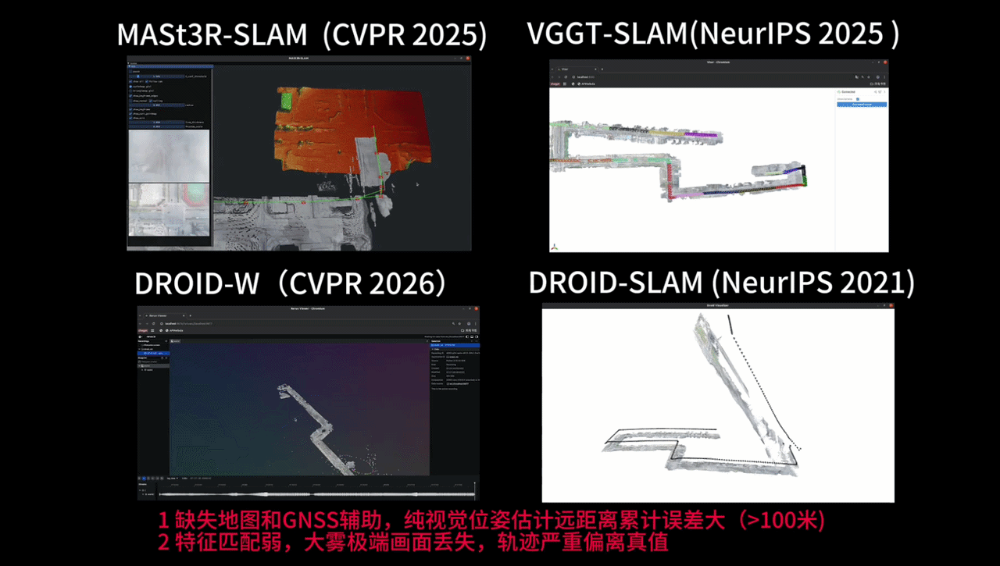
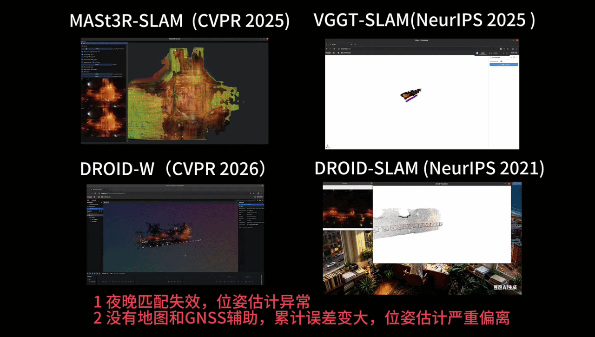

<p align="center">
  <h1 align="center">Atlas-Loc</h1>
  <p align="center">
    <strong>Li Dongdong</strong> |
    <strong>Yang Tao</strong> |
    <strong>Zhang Yisu</strong> |
    <strong>Qin Shuo</strong> |
    <strong>Li Jing</strong>
  </p>
  <h3 align="center">
    <a href="https://robot-vision.net/">Paper</a> |
    <a href="https://robot-vision.net/">Bilibili Demo</a> |
    <a href="https://robot-vision.net/">YouTube Demo</a>
  </h3>
</p>

<h2 align="center">Qualitative Comparisons</h2>

<h3 align="center">Foggy Scene - Baseline Method</h3>

<p align="center">
  
</p>

<h3 align="center">Foggy Scene - Atlas-Loc (Ours)</h3>

<p align="center">
  
</p>

<h3 align="center">Night Scene - Baseline Method</h3>

<p align="center">
  
</p>

<h3 align="center">Night Scene - Atlas-Loc (Ours)</h3>

<p align="center">
  
</p>

<br>

## Overview

Atlas-Loc provides a challenging low-altitude UAV localization benchmark for
studying robust visual relocalization under severe appearance changes and GNSS
degradation.

## Dataset

The **FHY_dataset** is collected across representative urban and suburban
environments at **120-150 m** flight altitude, matching practical low-altitude
logistics and eVTOL route settings. Instead of flying arbitrarily over dense
building blocks, the trajectories follow roads, roadside green belts, and nearby
open areas, reflecting realistic airspace, safety-distance, and privacy
constraints.

<p align="center">
  
</p>

The dataset covers three typical low-altitude scenes: mixed high-rise and
low-rise urban areas, dense skyscraper regions with city-canyon effects, and
texture-sparse suburban roads with grassland and vegetation. Each scene is
repeatedly captured across seasons, time periods, weather conditions, and
illumination changes, including sunny, cloudy, overcast low-light, foggy, rainy,
and night-time flights.

These sequences introduce strong visual challenges such as cross-season
vegetation changes, large building shadows, low contrast, rain blur and
reflections, dynamic vehicles, extreme fog-induced visibility loss, and
day-to-night relocalization under street lighting. The dataset can therefore
serve as a benchmark for evaluating visual SLAM, learning-based SLAM, dense
matching SLAM, and map-based relocalization methods in realistic low-altitude
urban environments.

## Dataset Access

- [Baidu Netdisk](https://robot-vision.net/)

The final download page and related access instructions will be updated here.

## Repository Status

- Project page: not available at the moment
- Public code release: not planned for now
- Current repository focus: dataset introduction and project links

## Citation

If you find this dataset useful in your research, please cite:

```bibtex
@misc{atlasloc,
  title        = {Atlas-Loc},
  author       = {Li, Dongdong and Yang, Tao and Zhang, Yisu and Qin, Shuo and Li, Jing},
  year         = {2026},
  note         = {Dataset and project page information will be updated}
}
```
